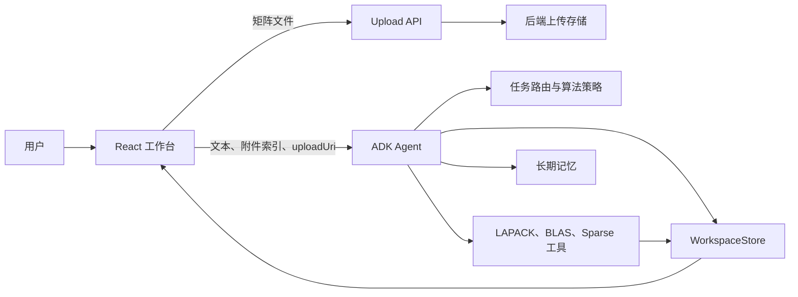

# 数值代数 Agent 工作区架构与优化规范

## 1. 文档定位

本文档用于指导当前 `NLA_Master` 数值线性代数 Agent 的后续实现，不再作为通用架构生成提示词使用。

当前 Agent 的技术基线包括：

- Google ADK `root_agent` 负责对话编排、工具注册与模型回调。
- Python 后端提供 Workspace、矩阵解析、LAPACK/BLAS、SciPy sparse、策略路由和长期记忆工具。
- React 前端采用三栏工作台：Current Folder、Agent 对话区、Workspace 变量面板。
- 矩阵上传通过 `nla-upload://<file_id>` 传递给后端，避免把浏览器本地路径或矩阵正文暴露给模型。
- 前端通过 `<nla-workspace>{...}</nla-workspace>` 标记同步 Workspace 快照。

核心优化目标是让 Agent 能稳定处理较大矩阵、稀疏矩阵、迭代过程和中间结果，同时避免上下文污染。

## 2. 核心原则

### 2.1 工作区是真值来源

矩阵、向量、分解结果、迭代历史和实验记录都应保存在后端 Workspace 中。对话上下文只保存对象引用、摘要和结论。

### 2.2 默认最小披露

Agent 默认只能看到对象句柄和摘要，不应收到完整矩阵、大向量、分解矩阵或长残差序列。需要局部数据时，必须通过受控读取接口获取。

### 2.3 工具优先

数值计算由工具完成，模型负责判断任务、选择算法、解释结果和安排下一步。常规线性代数优先使用 LAPACK/BLAS 或 SciPy sparse 工具，通用 Python 执行只作为兜底。

### 2.4 摘要服务于任务

摘要不是原始数据的替代品。摘要应回答“下一步该用什么算法、有什么风险、需要补什么信息”，而不是尽可能完整描述对象。

### 2.5 可追踪但分阶段实现

当前阶段先实现轻量审计日志，记录对象创建、摘要读取、切片读取、工具调用和结果写入。复杂权限、配额和防重建策略放到后续阶段。

## 3. 当前系统架构



模块职责：

- `agent.py`：组装 Agent、包装工具、管理模型输入输出回调、执行 Workspace 同步协议。
- `workspace.py`：保存变量与对象，生成上下文安全的句柄和摘要。
- `parsers.py` / `upload_api.py` / `upload_store.py`：处理矩阵文件上传、解析和 URI 解析。
- `linalg_backend.py` / `sparse_backend.py`：执行数值计算并返回可序列化结果。
- `policy.py`：识别任务、分析矩阵性质、推荐算法。
- `frontend/src/App.tsx` / `frontend/src/api.ts`：展示文件、对话、工具事件和 Workspace 快照。

## 4. Workspace 对象协议

Workspace 中每个对象都应具备统一元数据。为了兼容当前前端，保留现有字段，同时新增更明确的对象协议字段。

建议字段：

- `ref` / `name`：对象引用名，用于 `A_ref`、`b_ref` 等工具参数。
- `kind`：`scalar`、`vector`、`matrix`、`sparse_matrix`、`factorization`、`diagnostic`、`result`、`experiment`。
- `shape` / `size`：结构尺寸。
- `dtype`：数值类型。
- `storage_type`：`scalar`、`dense`、`sparse`、`structured`、`low_rank`、`summary_only`。
- `nnz` / `density`：稀疏对象或矩阵对象的非零元信息。
- `version`：对象版本，变量每次写入递增。
- `fingerprint`：对象轻量指纹，用于判断摘要是否对应当前版本。
- `summary`：面向模型和前端的短摘要。
- `source` / `updatedAt` / `notes`：来源、更新时间和说明。
- `preview_policy`：`safe`、`handle_only` 或 `summary_only`。

矩阵、大向量和分解结果返回给模型时必须使用句柄形式：

```json
{
  "object_handle": true,
  "matrix_handle": true,
  "ref": "A",
  "kind": "sparse_matrix",
  "shape": [100000, 100000],
  "storage_type": "sparse",
  "summary": "100000x100000 sparse matrix, nnz=742910, density=7.4e-5"
}
```

## 5. 摘要分层

### 5.1 基础摘要

用于 `workspace_list(detail=true)` 和前端 Workspace 面板：

- 类型、尺寸、dtype、稀疏性、复数属性。
- `nnz`、`density`、来源、更新时间、版本。
- 简短 `preview`，大对象显示句柄而不是元素。

### 5.2 数值摘要

通过受控工具按需生成：

- 范数、最大最小值、NaN/Inf 计数。
- 条件数估计、秩估计、残差范数。
- 对称性、正定性、对角占优等基础性质。

### 5.3 结构摘要

用于稀疏矩阵和特殊结构：

- 存储格式、带宽、行列非零分布。
- 对称模式、块结构、近似低秩迹象。
- 是否适合 CG、GMRES、eigsh、eigs 等算法。

### 5.4 任务驱动摘要

不同任务使用不同摘要重点：

- 线性方程组：方阵性、秩风险、条件数、残差、是否 SPD、稀疏性。
- 最小二乘：过定/欠定、秩亏、病态风险、推荐 driver。
- 特征值：方阵性、对称性、稀疏性、目标谱区间。
- 低秩近似：奇异值衰减、数值秩、压缩误差。
- 迭代法调试：残差历史摘要、收敛状态、异常迭代点。

## 6. 受控读取策略

下一阶段应补齐以下 Workspace 读取工具：

- `workspace_summary(name)`：返回对象句柄、版本和摘要。
- `workspace_stats(name)`：返回范数、值域、NaN/Inf、nnz、density 等统计信息。
- `workspace_structure(name)`：返回结构特征，不返回完整数据。
- `workspace_slice(name, rows, cols)`：返回小切片，必须限制元素数量。
- `workspace_audit(limit)`：返回最近访问和计算记录。

默认限制：

- 矩阵和大向量的 `workspace_get` 不返回完整元素。
- 单次切片元素数应有硬上限。
- 返回摘要应保持短小，避免把摘要本身变成上下文污染源。
- 完整对象导出只能返回文件路径或句柄，不能把原始数据写入对话。

## 7. 计算结果返回策略

当前输入矩阵已经基本做到句柄化，下一步要把结果也句柄化。

应保存为 Workspace 句柄的对象：

- 大规模解向量 `x`。
- 特征向量矩阵。
- LU、QR、Cholesky、SVD 等分解结果。
- 迭代残差长序列。
- 批量实验输出。

工具可以直接返回给模型的小结果：

- 标量结果。
- 小尺寸向量或矩阵。
- 残差范数、迭代次数、收敛状态、条件数估计。
- 结果对象引用名，例如 `x_ref="x"` 或 `factorization_ref="svd_A"`。

## 8. Agent 行为规范

Agent 每轮应遵循：

1. 简短确认用户目标。
2. 识别任务类型，必要时调用 `route_user_task`。
3. 如果用户提供矩阵文件，优先使用 `nla-upload://<file_id>` 调用矩阵读取工具。
4. 如果矩阵已在 Workspace，计算工具必须优先使用 `A_ref`、`b_ref` 等引用。
5. 缺少必要信息时只问最关键的一项，不机械追问完整清单。
6. 输出结论时先给关键结果和依据，再按需展开公式和步骤。
7. 最终回答前同步 Workspace 快照，供前端刷新变量面板。

## 9. 前端工作台要求

前端应继续围绕三栏工作流优化：

- Current Folder：文件索引、附件状态、上传 URI、矩阵正文省略说明。
- Agent 对话区：Markdown、LaTeX、工具调用过程、变量引用高亮。
- Workspace 面板：变量列表、对象摘要、版本、状态、来源和关键数值指标。

优先增强字段：

- `version`
- `kind`
- `storage_type`
- `nnz`
- `density`
- `norm`
- `cond_est`
- `status`
- `summary`

## 10. 分阶段优化路线

### Phase 1：防上下文污染闭环

- 统一 Workspace 对象协议。
- 新增受控摘要、统计、结构和切片读取工具。
- 大向量、大矩阵和分解结果统一保存为句柄。
- 增加单元测试，防止大对象重新进入上下文。

### Phase 2：可追踪与可解释

- 加入轻量审计日志。
- 前端展示更完整的 Workspace 详情。
- `policy.py` 支持基于摘要的任务驱动算法选择。
- 输出中清晰说明算法依据和数值风险。

### Phase 3：实验工作台能力

- 变量版本历史和依赖关系图。
- 会话回放和实验快照。
- 残差曲线、多实验对比和报告导出。
- 更严格的访问配额、防重建检测和导出策略。

## 11. 验收标准

Phase 1 完成后应满足：

- 文件加载的大矩阵只返回句柄和摘要。
- `workspace_get` 对矩阵、稀疏矩阵、大向量和分解结果不会返回完整数据。
- 计算工具支持通过 Workspace 引用复用对象。
- 前端 Workspace 面板能显示新增元数据且兼容旧快照。
- 单元测试覆盖矩阵句柄、受控切片、大结果句柄和审计记录。

Phase 2 完成后应满足：

- 用户能追踪对象创建、读取和计算路径。
- Agent 能基于摘要推荐算法，并说明关键依据。
- 前端可展示主要数值指标和异常状态。

Phase 3 完成后应满足：

- 用户能回放实验过程并比较多组结果。
- 完整数据导出受控，不进入对话上下文。
- 大规模稀疏矩阵和迭代任务具备稳定交互体验。
# 数值代数 Agent 工作区架构设计提示词（Markdown 版）

## 1. 目标
请为一个“数值代数 Agent”设计一套**高效、可扩展、低上下文污染**的系统架构。该 Agent 主要处理矩阵、向量、线性代数算法与数值计算任务，并需要在对话式交互中保持较强的工程可控性。

系统的核心目标是：

1. **矩阵数据不进入主上下文**：大矩阵、向量、稠密/稀疏数组等应存储在独立工作区（workspace）中，不应在对话上下文中完整展开。
2. **只暴露句柄与摘要**：模型默认只能看到对象句柄、基础元信息和受控摘要，不能被迫读取或回传完整元素。
3. **支持按需、最小披露的数据访问**：在必要时，允许读取局部切片、统计量或结构信息，但必须受访问策略约束。
4. **计算尽量在工作区完成**：中间结果应留在 workspace 中，模型在上下文里主要处理摘要、任务分解和最终结论。
5. **适合后续扩展为多工具、多阶段推理系统**：支持算法选择、诊断、调试、批处理与实验复现。

---

## 2. 背景与问题定义
在数值代数任务中，模型经常面对以下问题：

- 矩阵维度大，直接展开会占用大量上下文 token。
- 数值算法往往只需要矩阵的部分属性，而不是全部元素。
- 若将完整矩阵写入上下文，容易导致“上下文污染”，削弱推理质量。
- 某些任务需要多轮迭代和中间结果复用，纯对话式上下文不适合承载这些状态。

因此，需要将“**计算状态**”与“**自然语言上下文**”分离，建立一个受控的数据工作区。

---

## 3. 设计原则
请遵循以下原则进行架构设计：

### 3.1 上下文最小化
- 对话上下文只保留必要的任务描述、对象句柄、摘要和结论。
- 不允许把完整矩阵、长向量、稠密数据块直接写入对话历史。

### 3.2 工作区为真值来源
- 所有矩阵对象、向量对象、中间结果、缓存特征均存储于 workspace。
- 对象的实际数值以 workspace 内数据为准，不以对话文本为准。

### 3.3 最小披露
- 默认只能获取基础摘要。
- 仅在任务确有需要时，才允许受限地读取局部元素、切片或派生统计量。
- 访问量应尽可能小，返回内容应尽可能短。

### 3.4 工具优先
- 数值计算应尽量通过工具完成，而不是要求模型在文本中“手算”或“解释完整矩阵”。
- 模型负责决策、解释、编排，workspace 负责数据和执行。

### 3.5 可追溯
- 所有对象访问、摘要生成、切片读取、版本变更、算法执行都应记录审计日志。
- 需要能够追踪“模型看过什么、做过什么、基于什么摘要得出结论”。

### 3.6 任务驱动
- 摘要不应一刀切，而应根据任务类型动态生成。
- 例如：解线性方程、特征值问题、最小二乘、低秩近似、稀疏分解等，应侧重不同摘要。

---

## 4. 系统总体架构
请基于以下分层设计进行方案输出。

### 4.1 对话层（Conversation Layer）
职责：
- 接收用户自然语言输入。
- 将问题转化为可执行的数值任务。
- 只保存对象句柄、必要摘要和任务状态。

禁止：
- 直接保存大矩阵原始内容。
- 直接在消息中展开大规模数值数据。

### 4.2 任务编排层（Orchestration Layer）
职责：
- 分析任务类型。
- 决定是否需要访问 workspace。
- 选择工具、算法和工作流。
- 控制多步推理顺序。

应支持：
- 单步计算
- 多轮诊断
- 迭代算法
- 批量实验

### 4.3 工作区层（Workspace Layer）
职责：
- 存储矩阵、向量、稀疏结构、分解结果、残差、缓存特征等。
- 维护对象句柄、版本号、来源与生命周期。
- 提供受控访问接口。

建议对象都具备：
- `handle`
- `version`
- `shape`
- `dtype`
- `storage_type`（dense / sparse / structured / low-rank）
- `provenance`
- `summary`
- `fingerprint` 或 `hash`

### 4.4 数值计算层（Compute Layer）
职责：
- 在 workspace 内执行矩阵运算、分解、求解、估计和诊断。
- 返回标量、小对象和摘要结果，而不是完整原始数据。

### 4.5 访问控制层（Policy Layer）
职责：
- 控制哪些对象可见、可读、可切片、可导出。
- 管理默认摘要粒度与切片上限。
- 防止通过多次请求逐步重建完整矩阵。

### 4.6 审计与日志层（Audit Layer）
职责：
- 记录访问行为、对象版本变化、返回内容规模、工具调用轨迹。
- 便于调试、复现与安全控制。

---

## 5. 对象与数据模型
请将 workspace 中的数据对象抽象成统一对象模型。

### 5.1 基础对象类型
- Matrix
- Vector
- Factorization（如 LU、QR、Cholesky、SVD）
- Operator
- DiagnosticResult
- ExperimentRecord

### 5.2 对象属性建议
每个对象建议至少包含：
- `handle`: 全局唯一标识
- `version`: 版本号
- `kind`: 对象类型
- `shape`: 尺寸
- `storage_type`: 存储格式
- `summary`: 摘要信息
- `metadata`: 来源、创建时间、算法来源等
- `permissions`: 访问策略
- `fingerprint`: 哈希或指纹，用于校验一致性

### 5.3 版本化要求
- 对象若被修改，应产生新版本或显式版本递增。
- 上下文中的句柄必须可追溯到对应版本。
- 摘要必须与版本绑定，避免旧摘要误用到新对象。

---

## 6. 摘要设计
请设计**分层摘要**，而不是单一摘要。

### 6.1 基础摘要
包含：
- 维度
- 数据类型
- 稀疏/稠密类型
- nnz 或密度
- 是否对称、Hermitian、正定
- 是否对角占优
- 来源与版本

### 6.2 数值摘要
包含：
- 范数信息
- 值域或极值范围
- 均值、方差（若适用）
- 条件数估计
- 奇异值/特征值粗信息
- 残差与误差指标

### 6.3 结构摘要
包含：
- 带宽
- 块结构
- 稀疏模式
- 图结构特征
- 重复模式
- 低秩迹象
- 特殊结构（Toeplitz、Hankel、banded、block diagonal 等）

### 6.4 任务驱动摘要
摘要应根据任务类型动态调整，例如：
- 解线性方程：重点关注条件数、稀疏性、对称性、对角占优
- 特征值问题：重点关注谱范围、对称性、结构和可约性
- 低秩问题：重点关注奇异值衰减、数值秩估计、压缩误差
- 调试问题：重点关注局部异常值、残差峰值、数值不稳定点

### 6.5 摘要长度约束
- 摘要应短小精炼。
- 摘要不是原始数据的替代品，不应试图把所有信息都写进去。
- 摘要应优先服务于“下一步该做什么”，而不是“完整描述对象”。

---

## 7. 访问控制与最小披露策略
请为系统设计明确的数据访问规则。

### 7.1 默认规则
- 默认只返回句柄和摘要。
- 不返回完整矩阵元素。
- 不将大对象序列化进入对话上下文。

### 7.2 受控局部访问
当任务需要时，允许：
- 指定行/列/块切片
- 统计聚合
- 局部极值查询
- 局部结构查询

但应限制：
- 单次切片大小
- 单次返回 token 上限
- 单次返回元素数量上限
- 连续访问频率

### 7.3 防止重建
- 需要防止通过多次小切片请求拼回完整矩阵。
- 可考虑对访问行为进行速率限制、配额限制、异常检测或策略审计。

### 7.4 导出策略
- 若必须导出完整矩阵，应导出到文件或受控对象存储，而不是文本上下文。
- 对话中只返回导出路径、句柄或摘要。

---

## 8. 工具接口建议
请为系统设计一组清晰的工具接口。

### 8.1 对象管理接口
- `create_matrix(...)`
- `store_object(...)`
- `get_summary(handle)`
- `list_objects()`
- `update_object(handle, ...)`
- `delete_object(handle)`

### 8.2 受控读取接口
- `read_slice(handle, rows, cols)`
- `read_stats(handle)`
- `read_structure(handle)`
- `inspect(handle, mode='summary'|'local'|'diagnostic')`

### 8.3 计算接口
- `matvec(A, x)`
- `solve(A, b)`
- `lu(A)`
- `qr(A)`
- `svd(A)`
- `eig(A)`
- `norm(A)`
- `cond_est(A)`
- `residual(A, x, b)`

### 8.4 诊断接口
- `estimate_stability(...)`
- `estimate_rank(...)`
- `detect_structure(...)`
- `check_symmetry(...)`
- `check_diagonal_dominance(...)`

### 8.5 导出与复现接口
- `export_object(handle, format='mat'|'npy'|'csv'|'json')`
- `save_session(...)`
- `load_session(...)`
- `replay_log(...)`

---

## 9. 推荐交互流程
请按如下流程设计 Agent 的典型交互。

### 9.1 用户输入阶段
用户提出任务，例如：
- 求解线性方程组
- 分析矩阵是否适合某算法
- 检查数值稳定性
- 比较不同方法的效果

### 9.2 任务识别阶段
Agent 识别任务类型，并判断：
- 是否已有对象在 workspace
- 是否只需摘要即可决策
- 是否需要局部访问
- 是否应直接调用计算工具

### 9.3 摘要读取阶段
Agent 优先读取：
- 对象句柄
- 基础摘要
- 数值摘要
- 结构摘要

### 9.4 局部访问阶段
若摘要不足，再请求：
- 局部切片
- 统计信息
- 诊断视图

### 9.5 计算阶段
在 workspace 中执行计算，不把中间大对象回传上下文。

### 9.6 结果汇报阶段
最终仅向上下文返回：
- 结果摘要
- 核心指标
- 算法结论
- 必要的解释

---

## 10. 鲁棒性与性能要求
请同时考虑以下非功能性要求。

### 10.1 性能
- 低 token 占用
- 快速摘要生成
- 计算结果优先在 workspace 缓存
- 重复访问应利用缓存

### 10.2 稳定性
- 摘要与对象版本一致
- 工具失败时可恢复
- 局部读取失败不应破坏主会话

### 10.3 可扩展性
- 能支持更大矩阵
- 能支持更多对象类型
- 能支持多轮任务协作
- 能支持多工具链集成

### 10.4 可观测性
- 可查看对象访问历史
- 可诊断结果来源
- 可审计算法路径与数据路径

---

## 11. 需要特别防范的问题
请在设计中主动规避以下风险：

1. **上下文污染**：大矩阵进入文本历史，导致 token 浪费和推理退化。
2. **重复展开**：多次局部读取拼接回完整数据。
3. **摘要过载**：摘要本身过长，反而污染上下文。
4. **旧版本误用**：摘要和对象版本不一致。
5. **导出失控**：完整数据被当作普通文本返回。
6. **任务与数据耦合过深**：模型过分依赖原始元素而忽略结构信息。
7. **缺少审计**：无法复现模型到底访问了哪些数据。

---

## 12. 输出要求
请基于上述目标，输出一份完整、正式、可落地的系统架构方案，至少应包含：

1. 总体架构图的文字描述
2. 模块划分与职责说明
3. 数据对象与句柄机制设计
4. 摘要分层方案
5. 数据访问控制策略
6. 工具接口设计
7. 典型交互流程
8. 性能与安全性考虑
9. 可能的不足与改进方向
10. 适合继续细化的开放问题列表

---

## 13. 风格要求
请输出的方案满足以下风格：

- 用词正式、工程化、可执行。
- 重点突出“工作区 + 句柄 + 摘要 + 最小披露”的核心思想。
- 既要有架构层面的抽象，也要有接口与流程层面的细节。
- 不要只写概念性描述，要尽量给出可直接实现的建议。
- 如有必要，请补充你认为比当前方案更合理的机制。

